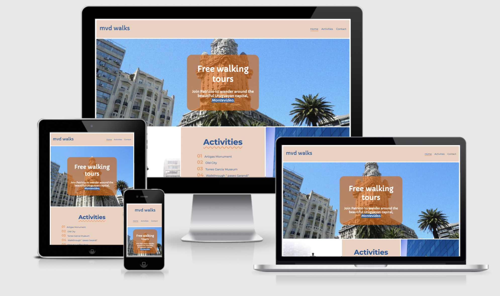
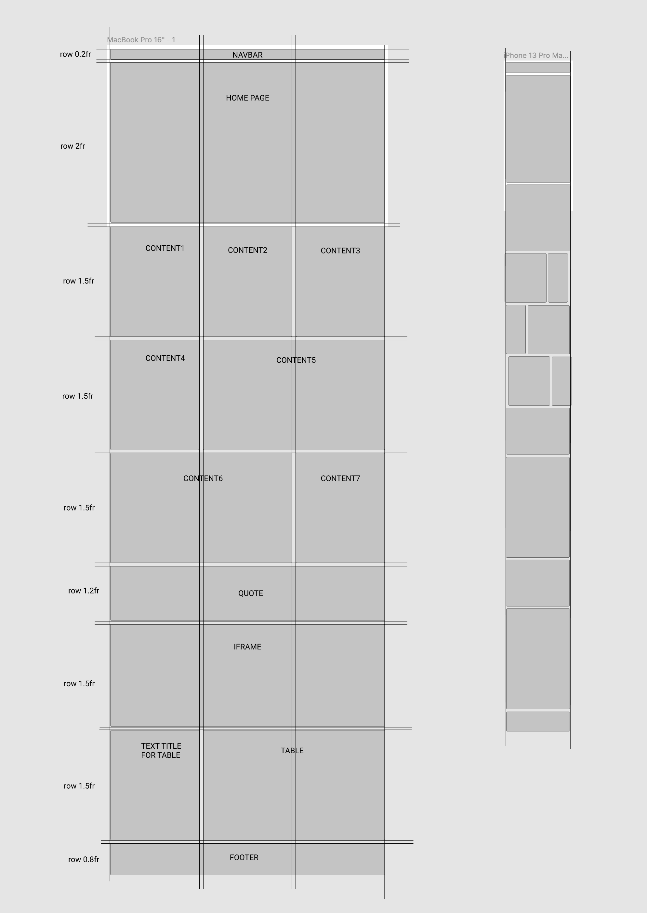
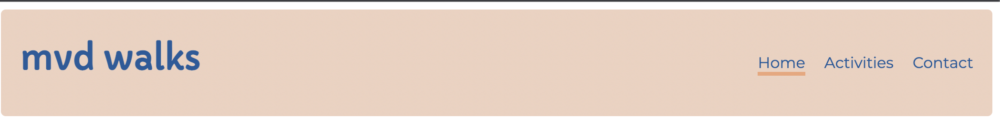
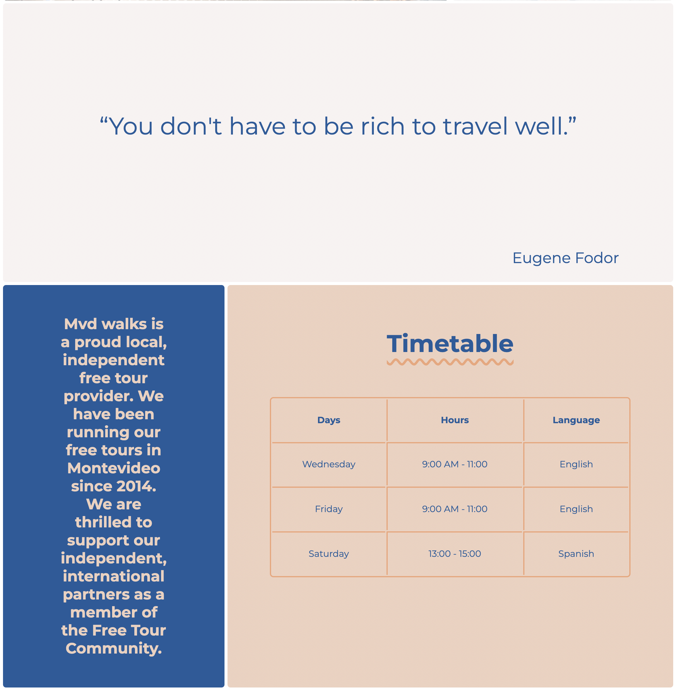
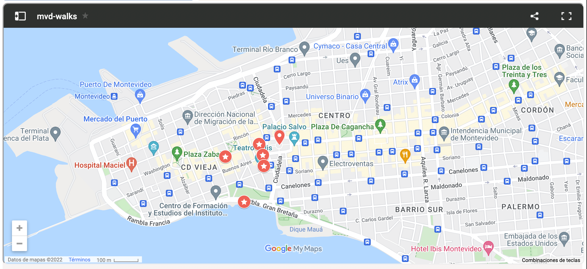
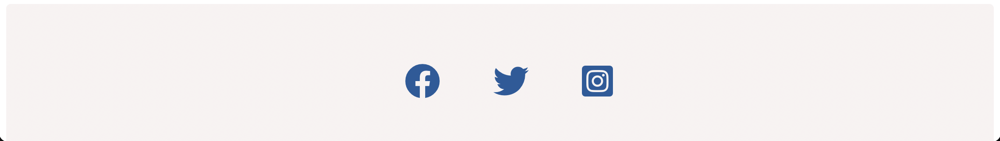
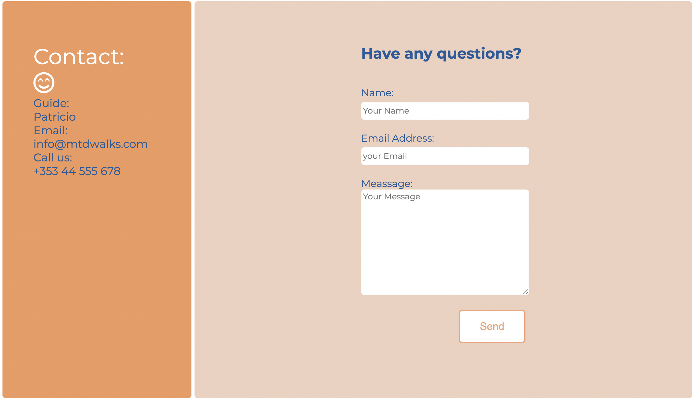
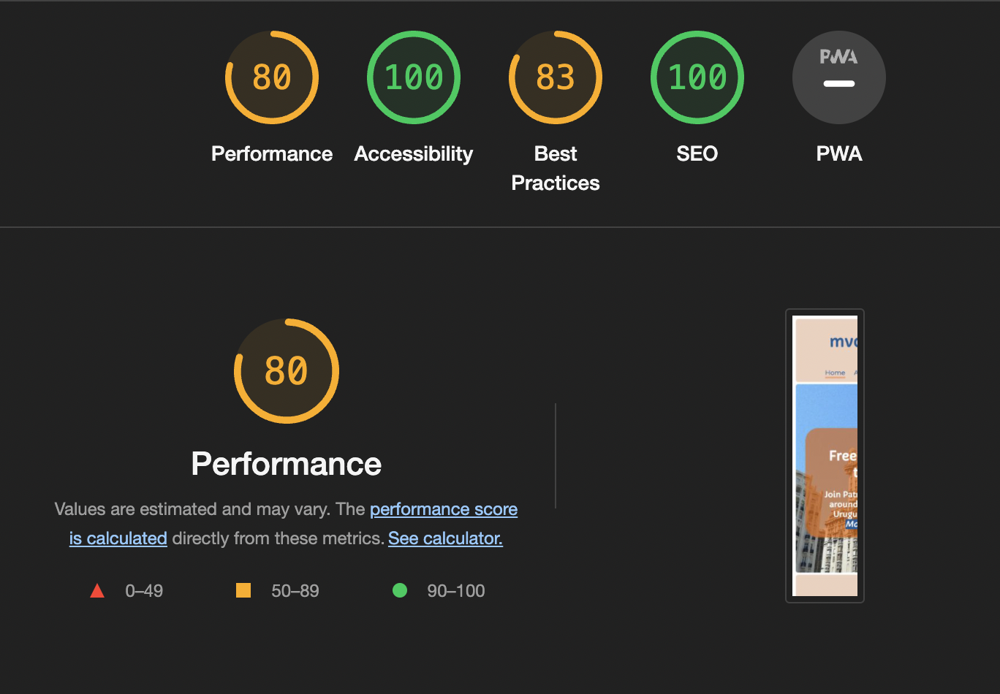
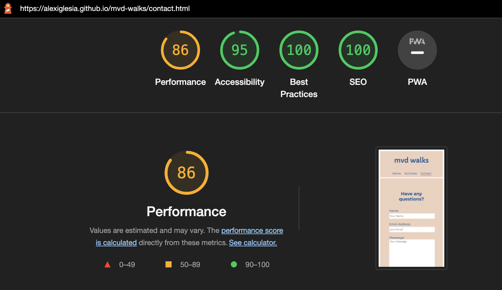

# Mvd Walks

This website is created mainly for any person interested in participating in a free walking tour in the city of Montevideo, Uruguay.

# UX Design
## Strategy Plane

### User

- As a user, I want to be able to find a free walking tour in Montevideo.
- As a user, I want to be able to contact the tour guide online.
- As a user, I want to be able to see the locations visited in the tour and timetable.

### Business Owner

- As the site owner, I want to be able to offer my services to prospective customers.
- As the site owner, I want to provide customers with a way to contact the touristic company.
 - As the site owner, I want to use this website to attract more customers to Montevideo.
 - As the site owner, I want to show the user my company opening hours.

## Scope Plane

- The website should have a Navigation menu that is consistent across all pages and devices.
- The website should have at the top of the home page a message for the user explaining to them who we are and where we are located.
- The website should list the activities on the tour.
- The website should include images to help users to visualize the tour activities.
- The website should give the user a way to contact the company for consultations through a form.  
- The website should give the user more contact methods including a phone number and an email address.  
- The website should include a map so the user can see the tour route.
- The website should include a timetable of the tour days, hours and language spoken.

## Structure Plane

To achieve the goals of the above the website should include at least 2 pages with different links and sections consisting of Home, Activities, Contact.

**Home Page**

-  Navigation with links
-  Free walking tour message to let users know the type of service offered.
-  Activities offered in the tour with images.
-  Information of the business.
-  Timetable with days, time and language.
-  Map with all the activities highlighted.
-  Footer section with links to the company's social media pages.

**Contact**

-   The contact page should have a contact form for the user to get in touch.
-   The form should collect contact details for the customer so that the merchant can contact them back.
-   The contact page should include multiple forms of contact including phone and email addresses.
-   The contact form should give the user feedback on submission.

## Skeleton Plane

### Home Page Desktop and Mobile Wireframe 

The design of the website was meant to have a minimal style that provided relevant information. The project was constantly updated while developing to achieve the design expected.

## Surface Plane

### Colour

I decided the best approach to this website was an attempt at minimalist design with a combination of colours to attract user attention.

The colors selected were:

-   rgb(29, 92, 151) - Blue
-   rgb(238, 208, 193) - Beige
	
Accents:
- rgb(238,164,127) Coral
- rgba(228, 95, 19, 0.644) Orange
- rgb(248, 242, 242) Off White
- #fff White

Other additional colours came through the images.

### Typography 

 The font's chosen for this project were:

-   Capriola
-   Montserrat

# Features

## Navigation

-   Featured at the top of the page, the navigation shows the touristic organization name: "mvd walks" that links to the top of the page.
-   The other navigation links are to the right: Home, Activities and Contact. The first two link to each section of the page. Contact links to another page.
-   The navigation tells the user the name of the touristic company and makes the different sections of information easy to find.
-   The colour selection is beige for most of the backgrounds. Blue is commonly associated as one of the colours that symbolise Uruguay, so it is implemented for text to create a contrast. Coral is used as an accent colour.

## Home 

-   The home page shows a brief introduction of the type of company promoted and where is it established. The font colour is white and an orange background is behind to let the text be more readable.
-   Also, there is a background image of one of the main locations visited on the tour. The background has a grain texture implemented with photoshop that adds value.
-   This section provides the user with clear information about what the site is and who it is for.

## Activities

-   This section gives an ordered list of activities.
-   The images have a number in the left corner that corresponds to each activity.
-   The images are displayed playfully to attract the user's attention.

## Introduction to the organization, Inspirational quote and Timetable

These three topics are divided into three sub-sections.

-   The first section has one quote to attract user attention. This quote suggests the tour's quality and points to the fact of being a free activity.
-   The second sub-section is a text explaining the type of organization and empathizing in being a free activity and gives confidence to users expressing since when the organization is running.
-   The last sub-section shows the user a table with the company meeting times and what language is spoken each day.

## Location 

-   The google map shows the activities and meeting points.

## Footer

-   The footer has three icons that link to the main social media to find more information about the tour.

## Contact 

-   This page has the guide's contact details and a contact form in case users need more information.
-   The form does not collect data, it provides a thank you message as feedback to simulate a real form. The method is not “post” for this reason.

# Features Left to implement

-   As the service provided by the guide is free is it common for tourists to recompense the guide with tips. I would add a page explaining this, and a link to a donate page or website able to transfer money to the guide in an easy way.
-   I would like to add a section with a horizontal scroll snap with photos of groups of people participating in the tour.

# Technology Used

### Html

Used to structure my web pages.

### CSS

Used to style and add layout to my project.

### Font Awesome

Used for the icon on the contact page

### GoogleFonts

Used for all the fonts used in this project

### Google map 

Used to embed the I-frame on the home page of a fictional organization based in Montevideo, Uruguay.

### Tinyjpg.com

Used to reduce the size of images and improve web loading speed.

## Bugs

-   When I deployed my project to GitHub Pages and used the "Am I responsive?" website I discovered the "cover-text" orange box on the home page missed a margin-button to be in the correct position.

**Unfixed Bugs**
-   When I deployed my project and tried to view it on my phone the text inside the orange was overflowed and the underline decoration text was missing.

## Validator Testing

When I validate my project to validator W3C I discovered my iframe had an error because of the % symbol being used.

-   I fixed this error by removing the % symbol in the HTML and changing the height to px and the width remain in % but was stated in the CSS.
-   Another error was created for using an H1. I change the H1 from the nav and added an H2.

**HTML**

After fixing this, no errors were returned when using the W3C validator.

**CSS**

No errors were found when passing through the official Jigsaw validator.

**Accessibility**

I confirm that the colours and fonts chosen are easy to read and accessible by running it through lighthouse in dev tools.
 
 **Home page**

**Contact page**

# Deployment 

The site was deployed to GitHub pages. The steps to deploy are as follows:

-   In the GitHub repository, navigate to the settings tab.
-   From the source section drop-down menu, select the main branch.
-   Once the main branch has been selected, the page provided the link to the completed website.

The live link can be found here:

# Credits

## Content & Resources

-   The code to make the social media links were taken from the CI Love running project.
-   I also used several links to fix errors and create the website:
-   css-tricks, developer.mozilla.org, stackoverflow.com, baby_wolf_codes.

 The structure of the website with grids: 
 https://www.youtube.com/watch?v=68O6eOGAGqA&t=630s

Text for content:
https://www.dublinfreewalkingtour.ie/

To indent code:
[https://www.freeformatter.com

To write readme:
https://stackedit.io/app#

Also, I use as a reference the readme of Code Institute project example and classmate Alan Bushell.

## Media

The media from the home page was taken from Unsplash, Pexels and google images.

# Acknowledgements

Jack Wachira

My mentor provided me with constructive feedback.
